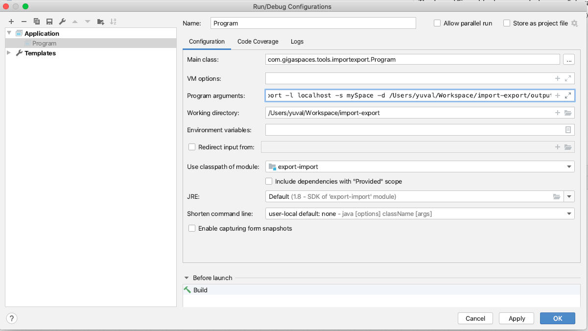

# Introduction

The Import/Export tool was created as a collaborative effort between GigaSpaces Professional Services and GigaSpaces Support to facilitate reliable and efficient snapshots of data in a XAP datagrid.

Instructions on how to use the Import/Export tool and how it was implemented can be found on GigaSpaces [Best Practices](http://docs.gigaspaces.com/sbp/export-import-tool.html) wiki.

### Build and Running the Tool
#### PreRequisites
 * Java IDE
 * JDK 1.8
 * Apache Maven
 
##### Configuration
Check the pom.xml file to ensure `gsVersion` is configured to use the same version of XAP you installed with the Maven Plugin.

> To determine the exact version number you will need to pull it from within `<XAP_INSTALL_DIR>/tools/maven/maven-openspaces-plugin/pom.xml`
> Alternatively you can find the version as a directory name in your .m2 folder `.m2/repository/com/gigaspaces/gs-openspaces`

    <properties>
        <gsVersion>15.5.0</gsVersion>
        ...
    </properties>

#### Building

mvn clean package

#### Running

Option 1 (from the IDE using maven)  
 a. Deploy the newly built export-import-1.0.SNAPSHOT.jar into your local git repository.  

        mvn install:install-file -Dfile=../import-export/target/export-import-1.0-SNAPSHOT.jar -DgroupId=org.gigaspaces -DartifactId=xap-export-import -Dversion=14.5.0 -Dpackaging=jar
 b. Click on "Edit Configurations" and set it with:  
 Main class: com.gigaspaces.tools.importexport.Program  
 Program arguments: -o export -l $LOOKUPLOCATORS -s <Your Space> -d <Yout output location> 

 
 
 Option 2 (from CLI using maven classpath) - currently not working  
 
        mvn exec:java -Dexec.mainClass=com.gigaspaces.tools.importexport.Program -o export -l $LOOKUPLOCATORS -s mySpace -d /var/exporter/output

Option 3 (setting the classpath)  
 a. Copy the newly built export-import-1.0.SNAPSHOT.jar into the lib directory.  
 b. Run  
 
        $JAVA_HOME\bin\java -cp $GS_HOME/lib/required/*:./lib/* com.gigaspaces.tools.importexport.Program -o export -l $LOOKUPLOCATORS -s mySpace -d /var/exporter/output
